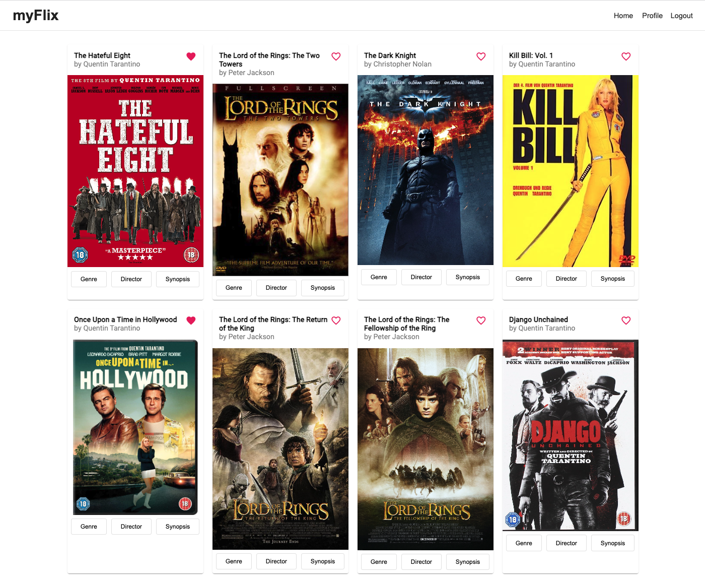

# MyFlixAngularClient

A single-page, responsive app with routing, rich interactions, several interface views,
and a polished user experience built with Angular. The client-side developed in this repo supports
the existing [server-side](https://github.com/kjb92/myFlix) by facilitating user requests and rendering the response from the server-side via a number of different interface views.

This project was generated with [Angular CLI](https://github.com/angular/angular-cli) version 16.1.3.



# Table of Contents

1. [Getting Started](#getting-started)
2. [Technical Requirements](#technical-requirements)
3. [Features](#features)
4. [Built With](#built-with)

# Getting Started
## Live Test-Version
For a live test version of the API, simply go to `https://kjb92.github.io/myFlix-Angular-client`

## Clone the repo
Follow the instructions below to get a copy of the project up and running on your local machine for development and testing purposes:

1. Open your terminal and navigate to the directory where you want to clone the repository.
2. Clone the repository:
```bash
git clone https://github.com/kjb92/myFlix-Angular-client.git
```

2. Navigate to the root directory of the project.
3. Run `npm install` to install all dependencies.
4. Run `ng serve` for a dev server. 
5. Navigate to `http://localhost:4200/`. The application will automatically reload if you change any of the source files.
6. Run `ng build` to build the project. The build artifacts will be stored in the `dist/` directory.


# Technical requirements
- The application must be written in Angular (version 9 or later)
- The application requires the latest version of Node.js and npm package
- The application must contain user registration and login forms
- The application must be designed using Angular Material
- The application's codebase must contain comments using Typedoc
- The project must contain technical documentation using JSDoc
- The project must be hosted on GitHub Pages

# Features
- The app displays a welcome view where users will be able to either log in or register an account.
- Once authenticated, the user is logged in and will see the movies view displaying all movies.
- A single movie card will contain the following additional features:
- A button that when clicked displays the director view, where details about the director of that particular movie will be displayed.
- A button that when clicked displays the genre view, where details about the movie's genre will be displayed.

# Built with
- TypeScript
- Angular

## Dependencies
This is an excerpt of the highlight dependencies. For the full list of dependencies see package.json
- `@angular/animations": "^16.1.0"`,
- `"@angular/platform-browser": "^16.1.0"`,
- `"@angular/router": "^16.1.0",`
- `"@angular/forms": "^16.1.0",`
- `"@angular/material": "^16.1.3"`

## Dev Dependencies
This is an excerpt of the highlight dev-dependencies. For the full list of dependencies see package.json
- `"@angular-devkit/build-angular": "^16.1.3"`,
- `"@angular/cli": "~16.1.3"`,
- `"angular-cli-ghpages": "^0.6.2"`,
- `"typedoc": "^0.24.8"`,
- `"typescript": "~5.1.3"`